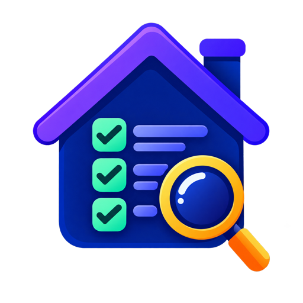

# HA Organizer

  

HA Organizer is a read-only Home Assistant custom integration for auditing the
organization of your installation. It provides a single place to inspect naming
consistency, duplicate or missing resources, review progress, and links to the
native Home Assistant screens where changes can be made manually.

> HA Organizer is currently in beta. Audit rules and the interface may evolve
> as the integration is used with more Home Assistant installations.

## What it does

The integration adds an **HA Organizer** panel to Home Assistant with these
modules:

- **Overview** — consolidated compliance and review progress.
- **Categories** — compares automation and script categories, including names
  and icons.
- **Areas** — inventories areas, devices, and associated entities.
- **Zones** — reviews names, icons, radius, coordinates, and duplicate geometry.
- **Labels** — inventories label names, icons, and colors.
- **Entity IDs** — compares entity IDs with the naming policy configured in the
  Organizer.
- **Exposed & Aliases** — finds collisions among exposed names and aliases.

All modules are opt-in through the **Settings** page. The integration does not
rename, create, delete, or otherwise modify Home Assistant resources.

### Recommended organization flow

The Overview page presents the suggested maintenance order:

1. Areas
2. Zones
3. Labels
4. Categories
5. Entity IDs
6. Exposed & Aliases

This is a practical navigation order, not a requirement. Each module can be
opened independently whenever its native Home Assistant data is ready.

## Review model

HA Organizer keeps technical compliance separate from human review:

- `compliant`, `non_compliant`, `attention`, and `not_applicable` describe the
  calculated audit result.
- `pending`, `reviewed`, `ignored`, and `stale` describe the user's progress.

Reviewed and ignored items are associated with a fingerprint of the relevant
data. If that data changes, the item becomes stale and can be reviewed again.
Only the Organizer's own settings, review decisions, and scan data are stored.

## HACS availability

HA Organizer is not currently in the default HACS catalog; it is available as
an HACS custom repository. Install it using
`https://github.com/alves-dev/ha-organizer` and the **Integration** category.

## Installation

### HACS

1. Open **HACS > Integrations** and add
   `https://github.com/alves-dev/ha-organizer` as a custom repository in the
   **Integration** category.
2. Search for **HA Organizer**.
3. Install the integration and restart Home Assistant.
4. Open **Settings > Devices & services > Add integration**.
5. Search for **HA Organizer** and complete the minimal setup.

### Manual

Copy the `custom_components/ha_organizer` directory into the
`custom_components` directory of your Home Assistant configuration, restart
Home Assistant, and add the integration from **Settings > Devices & services**.

## Native Home Assistant links

Where possible, the panel links directly to the native Home Assistant pages:

- Areas: `/config/areas/dashboard`
- Zones: `/config/zone`
- Labels: `/config/labels`
- Exposed entities: `/config/voice-assistants/expose`

These links are intentionally simple navigation links. HA Organizer does not
edit native resources through its own WebSocket API.

## Compatibility

HA Organizer currently targets Home Assistant `2026.8.x`. See the
[compatibility matrix](docs/compatibility.md) for tested combinations and
release guidance.

## Development

Contributor commands, local Home Assistant testing, coverage requirements, and
SonarQube validation are documented in [Development and quality checks](docs/development.md).

## Privacy and safety

HA Organizer is local and read-only with respect to Home Assistant resources.
The panel may display entity names, areas, zones, and exposure information to
Home Assistant administrators, so access to the Home Assistant instance should
be protected in the usual way. Zone coordinates are shown with reduced visual
emphasis in the panel.

## Documentation

- [Compatibility matrix](docs/compatibility.md)
- [Development and quality checks](docs/development.md)
- [Product and architecture specification](docs/product-specification.md)
- [Changelog](CHANGELOG.md)
- [Icon concepts](docs/icons/README.md)

## License

HA Organizer is distributed under the [MIT License](LICENSE).
